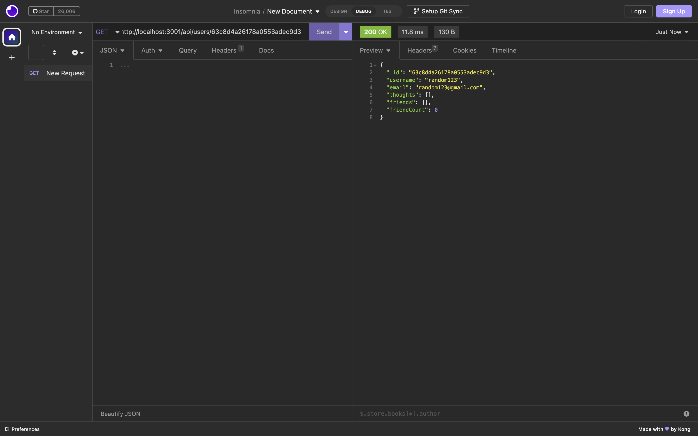

# Social Media API
## Description

This API is built with MongoDB for a social network web application to handle large amounts of unstructured data, allowing users to share their thoughts, react to friends’ thoughts, and create a friend list.

## Table of Content

* [Installation](#installation)

* [Usage](#usage)

* [Contributing](#contributing)

* [Questions](#questions)   

## Installation

To install all necessary dependencies for development purposes, please run the command below:  

``npm init -y``  

``npm i``

## Usage

To use this application, simply initialize the npm and install the necessary packages (as instructed above). Then, start the server (or run `npm run dev`) and use the different API routes as needed, including GET, POST, PUT, and DELETE for users and thoughts. There are also POST and DELETE routes for adding/removing friend from friendlist and adding/removing reactions to a specific thought. View some examples of the application's API routes being tested in Insomnia Core below.
 

 
  

  

  

  

[To preview more features, watch the walkthrough video here.](https://drive.google.com/file/d/1nrQ3geWw5qHMHthgyd0plnafEOp6xEpp/view)

## Contributing

There are many ways in which you can participate in this project.
Users can contribute to this repo by submitting bugs and feature requests, reviewing source code changes, and making pull requests for any issues they can find.    

## Questions

For any questions or feedback, please feel free to email me at nbtrieu@uci.edu.
If you would like to check out more of my projects, please visit [nbtrieu](https://github.com/nbtrieu).
